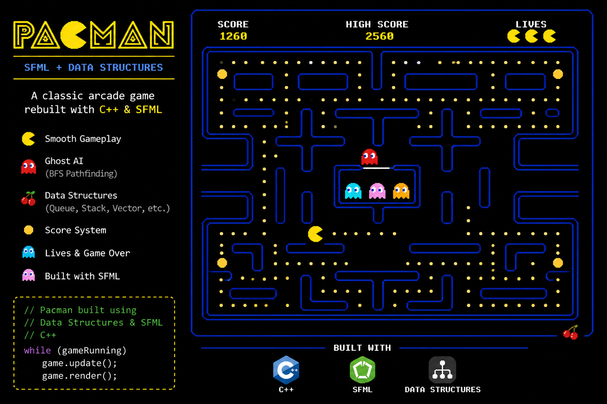

# 👾 PacMan Game using Data Structures (C++ & SFML)

  

  
  
  
  

<h3 align="center">🎮 A Classic PacMan Game Built with Data Structures & SFML</h3>

---

## 📖 Overview  

This project is a **PacMan-style game** developed using **C++ and SFML**, focusing on the application of **Data Structures and Algorithms** in game development.

It demonstrates how fundamental concepts like **queues, graphs, and arrays** can be used to build an interactive and real-time game.

---

## 🎯 Objectives  

- Apply **Data Structures concepts** in a real-world project  
- Implement **game logic and movement algorithms**  
- Develop a graphical game using **SFML**  
- Strengthen problem-solving and design skills  

---

## 🚀 Features  

- 👾 **PacMan Character Movement**  
- 👻 **Ghost AI Movement**  
- 🧱 **Maze/Grid-based Map System**  
- 🍒 **Food Collection & Scoring System**  
- ⚡ **Collision Detection (Walls & Ghosts)**  
- 🎮 **Real-Time Keyboard Controls**  
- 🖥️ **Smooth Rendering using SFML**  

---

## 🧠 Data Structures Used  

- 🟦 **Arrays / Grids** → Represent game map  
- 🔁 **Queues** → Ghost movement logic / BFS  
- 🌐 **Graphs** → Pathfinding in maze  
- 📦 **Vectors** → Dynamic game objects  
- 🧩 **Stacks (optional)** → Backtracking / movement logic  

---

## 🛠️ Tech Stack  

- 💻 C++  
- 🎨 SFML (Simple and Fast Multimedia Library)  
- 🧠 Data Structures & Algorithms  

---
